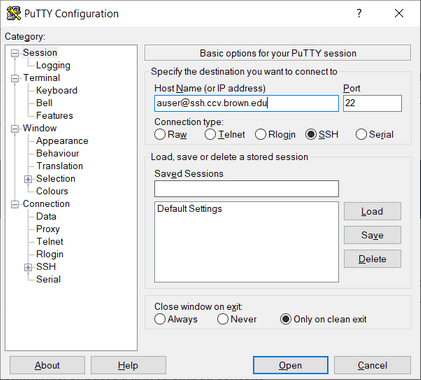
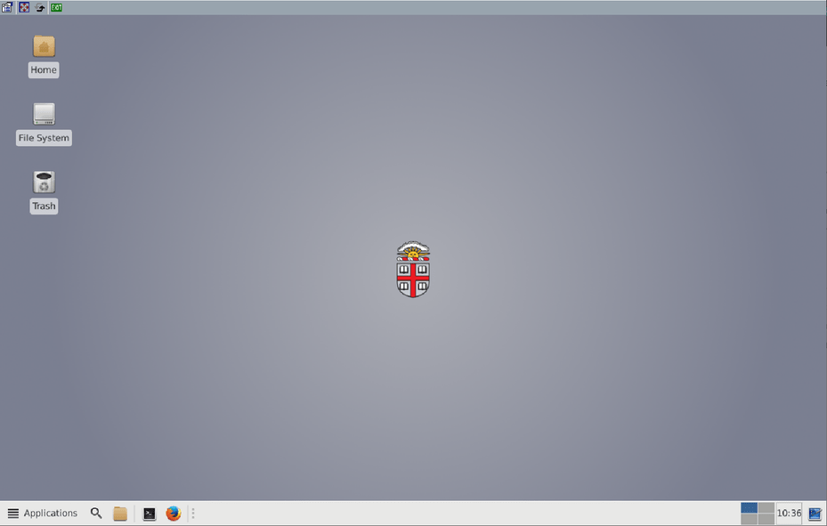

# Quickstart Guide

This guide assumes you have an Oscar account. To request an account see [create an account](https://brown.co1.qualtrics.com/jfe/form/SV\_0GtBE8kWJpmeG4B).


If you're confused about any acronyms or terms throughout the guide, check out our [Quick Reference](quick-reference/) page to see definitions of commonly used terms


### OSCAR





Oscar is the shared compute cluster operated by CCV.

Oscar runs the Linux RedHat7 operating system. General Linux documentation is available from [The Linux Documentation Project](http://tldp.org/LDP/intro-linux/html/). We recommend you read up on basic Linux commands before using Oscar. Some of the most common commands you'll be using in Oscar can also be found on our [Quick Reference page](quick-reference/).


If you'd like a brief introduction to Linux commands, watch [our tutorial on Linux basics on Oscar](https://brown.hosted.panopto.com/Panopto/Pages/Viewer.aspx?id=5962a33f-a0ae-4d4e-9a4b-ad11012fe331).


Oscar has two login nodes and several hundred compute nodes. When users log in through Secure Shell (SSH), they are first put on one of the login nodes which are shared among several users at a time. You can use the login nodes to compile your code, manage files, and launch jobs on the compute nodes from your own computer. Running computationally intensive or memory intensive programs on the login node slows down the system for all users. Any processes taking up too much CPU or memory on a login node will be killed. **Please do not run Matlab on the login nodes.**

### What username and password should I be using?

* If you are at Brown and have requested a regular CCV account, your Oscar login will be authenticated using your Brown credentials, i.e. the same username and password that you use to log into any Brown service such as "canvas". _We have seen login problems with the Brown credentials for some users so accounts moved to the RedHat7 system after September 1st 2018 can also log into RedHat7 with their CCV password._
* If you are an external user, you will have to get a sponsored ID at Brown through the department with which you are associated before requesting an account on Oscar. Once you have the sponsored ID at Brown, you can [request an account](https://brown.co1.qualtrics.com/jfe/form/SV\_0GtBE8kWJpmeG4B) on Oscar and use your Brown username and password to log in.

### Connecting to Oscar for the first time

To log in to Oscar you need Secure Shell (SSH) on your computer. Mac and Linux machines normally have SSH available. To login in to Oscar, open a terminal and type

```
ssh <username>@ssh.ccv.brown.edu
```

Windows users need to install an SSH client. We recommend [PuTTY](http://www.chiark.greenend.org.uk/\~sgtatham/putty/download.html), a free SSH client for Windows. Once you've installed PuTTY, open the client and use `<username>@ssh.ccv.brown.edu`for the Host Name and click Open. The configuration should look similar to the screenshot below.



The first time you connect to Oscar you will see a message like:

```
The authenticity of host 'ssh.ccv.brown.edu (138.16.172.8)' can't be established.
RSA key fingerprint is SHA256:Nt***************vL3cH7A.
Are you sure you want to continue connecting (yes/no)? 
```

You can type `yes` . You will be prompted for your password. Note that nothing will show up on the screen when you type in your password; just type it in and press enter. You will now be in your home directory on Oscar. In your terminal you will see a prompt like this:

```
[mhamilton@login004 ~]$ 
```

Congratulations, you are now on one of the Oscar login nodes.


**Note: Please do not run computations or simulations on the login nodes**, because they are shared with other users. You can use the login nodes to compile your code, manage files, and launch jobs on the compute nodes.


### Changing CIFS Passwords

To change your [CIFS](connecting-to-oscar/cifs.md) password, use the command:

```
$ smbpasswd
```

Password reset rules:

* minimum length: 8 characters
*   should have characters from all 4 classes: upper-case letters,

    lower-case letters, numbers and special characters
* a character cannot appear more than twice in a row
*   cannot have more than 3 upper-case, lower-case, or number characters

    in a row
* at least 3 characters should be different from the previous password
* cannot be the same as username
* should not include any of the words in the user's "full name"

## File system

Users on Oscar have three places to store files:

* home
* scratch
* data

Note that class accounts may not have a data directory. Users who are members of more than one research group may have access to multiple data directories.

From the home directory, you can use the command `ls` to see your scratch directory and your data directory (if you have one) and use `cd` to navigate into them if needed.

To see how much space you have, use the command `myquota`. Below is an example output:

```
                   Block Limits                              |           File Limits              
Type    Filesystem           Used    Quota   HLIMIT    Grace |    Files    Quota   HLIMIT    Grace
-------------------------------------------------------------|--------------------------------------
USR     home               8.401G      10G      20G        - |    61832   524288  1048576        -
USR     scratch              332G     512G      12T        - |    14523   323539  4194304        -
FILESET data+apollo        11.05T      20T      24T        - |   459764  4194304  8388608        -
```


Files not accessed for 30 days may be deleted from your scratch directory. This is because scratch is high performance space. The fuller scratch is, the worse the read/write performance. Use \~/data for files you need to keep long term.


A good practice is to configure your application to read any initial input data from `~/data` and write all output into `~/scratch`. Then, when the application has finished, move or copy data you would like to save from `~/scratch` to `~/data`. For more information on which directories are backed up and best practices for reading/writing files, see [Oscar's Filesystem](managing-files/filesystem.md) and  [Best Practices](managing-files/io-best-practices.md). You can go over your quota up to the hard limit for a grace period. This grace period is to give you time to manage your files. When the grace period expires you will be unable to write any files until you are back under quota.

You can also transfer files to and from the Oscar Filesystem from your own computer. See [Transferring Files to and from Oscar](managing-files/filetransfer.md).

## Software modules

CCV uses the [PyModules](https://bitbucket.org/mhowison/pymodules) package for managing the software environment on OSCAR. To see the software available on Oscar, use the command `module avail`. You can load any one of these software modules using `module load <module>`. The command `module list` shows what modules you have loaded. Below is an example of checking which versions of the module 'workshop' are available and loading a given version.

```
[mhamilton@login001 ~]$ module avail workshop
~~~~~~~~~~~~~~~~~~~~~~~~~~~~~~ name: workshop*/* ~~~~~~~~~~~~~~~~~~~~~~~~~~~~~~~
workshop/1.0  workshop/2.0  
[mhamilton@login001 ~]$ module load workshop/2.0
module: loading 'workshop/2.0'
[mhamilton@login001 ~]$ 
```

For a list of all PyModule commands, see [Software Modules](software/software.md). If you have a request for software to be installed on Oscar, email support@ccv.brown.edu.

## Using a Desktop on Oscar

You can connect remotely to a graphical desktop environment on Oscar using CCV's [VNC client](broken-reference). The CCV VNC client integrates with the scheduling system on Oscar to create dedicated, persistent VNC sessions that are tied to a single user.

Using VNC, you can run graphical user interface (GUI) applications like Matlab, Mathematica, etc. while having access to Oscar's compute power and file system.



For download and installation instructions, [click here](broken-reference).

## Running Jobs

You are on Oscar's login nodes when you log in through SSH. You should not (and would not want to) run your programs on these nodes as these are shared by all active users to perform tasks like managing files and compiling programs.

With so many active users, a shared cluster has to use a "job scheduler" to assign compute resources to users for running programs. When you submit a job (a set of commands) to the scheduler along with the resources you need, it puts your job in a queue. The job is run when the required resources (cores, memory, etc.) become available. Note that since Oscar is a shared resource, you must be prepared to wait for your job to start running, and it can't be expected to start running straight away.

Oscar uses the **SLURM** job scheduler. Batch jobs are the preferred mode of running programs, where all commands are mentioned in a "batch script" along with the required resources (number of cores, wall-time, etc.). However, there is also a way to run programs interactively.

For information on how to submit jobs on Oscar, see [Running Jobs](submitting-jobs/shared-machine.md).&#x20;

There is also extensive documentation on the web on using SLURM ([quick start guide](https://slurm.schedmd.com/quickstart.html)).

## Where to get help

* Online resources: [SLURM](https://slurm.schedmd.com/), [Linux Documentation](https://tldp.org/LDP/intro-linux/html/),  [Basic Linux Commands](https://www.hostinger.com/tutorials/linux-commands), [stackoverflow](http://stackoverflow.com/)
* CCV's page detailing [common problems](getting-help/faq.md) you might face on Oscar
* Email [support@ccv.brown.edu](mailto:support@ccv.brown.edu)
