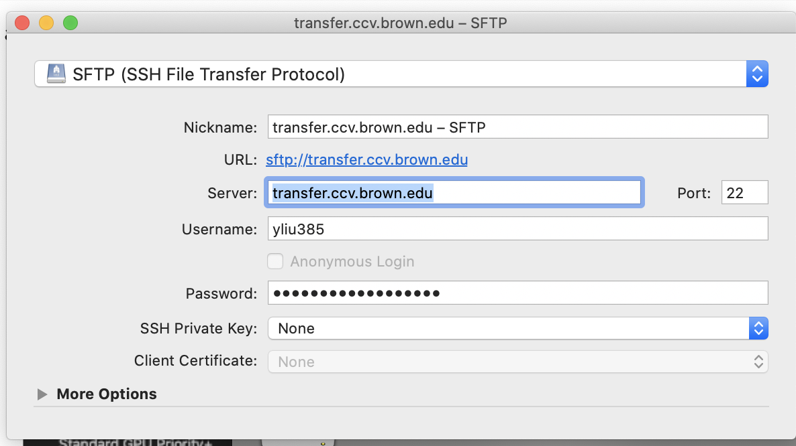
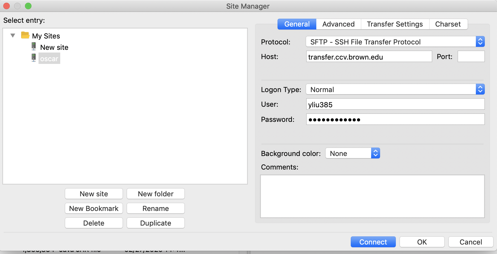

# Transferring Files to and from Oscar


Oscar has transfer nodes with a high speed conection for quickly moving data. To use the transfer nodes use `transfer.ccv.brown.edu` as the host address.


There are several ways to move files between your machine and Oscar. Which method you choose will depend on how much data you need to move and your personal preference for each method.

1. [CIFS](../connecting-to-oscar/cifs.md)
2. [Command line \(scp\)](filetransfer.md#2-command-line)
3. [GUI application](filetransfer.md#3-gui-programs-for-transferring-files-using-the-scp-or-sftp-protocol)
4. [Globus online](filetransfer.md#4-globus-online)


Globus online is the best for transferring large amount of data from other Globus endpoints like files.brown.edu. 


## 1. CIFS

You can drag and drop files from your machine to the Oscar filesystem with CIFS. This is an easy method for a small number of files.

## 2. Command line

**Mac and Linux**

You can use `scp` to transfer files. For example to copy a file from your computer to Oscar:

```text
     scp /path/to/source/file <username>@transfer.ccv.brown.edu:/path/to/destination/file
```

To copy a file from Oscar to your computer:

```text
     scp <username>@transfer.ccv.brown.edu:/path/to/source/file /path/to/destination/file
```

**Windows** On Windows, if you have PuTTY installed, you can use it's `pscp` function from the terminal.

## 3. GUI programs for transferring files using the `scp` or `sftp` protocol

In general, you can specify the followings for your GUI programs:

* Protocol: SSH File Transfer Protocol
* Host: transfer.ccv.brown.edu
* User: your Oscar username
* Password: your Oscar password

### 3.1 [WinSCP](https://winscp.net/eng/index.php) for Windows

### 3.3 [Cyberduck](https://cyberduck.io) for Mac



### 3.1 [FileZilla](https://filezilla-project.org) for all platforms

Open the site manage, then add a new site with the followings:



## 4. Globus online

[Globus](https://www.globus.org) is a secure, reliable research data management service. You can move data directly to Oscar from anothe Globus endpoint. Oscar has one Globus endpoint:

```text
Brown_CV_Oscar
```


The two old endpoints will be retired on 12/1/2020

brownccv\#Brown-CCV-oscar-1

brownccv\#Brown-CCV-oscar-2


If you want to use Globus Online to move data to/from you own machine, you can install Globus Connect Personal. For more instructions on how to use Globus, see the [Oscar section](https://docs.ccv.brown.edu/globus/creating-endpoints/using-globus-with-oscar) in the Globus documentation.

